# Sentiment Analysis on Amazon Fine Food Reviews


This is a natural language processing project (NLP) using Python with NLTK, and Hugging Face Roberta Transformers to analyze fine food sentiments on Amazon

This project utilized **3 different approaches for sentiment analysis**:

1. [Valence Aware Dictionary and sEntiment Reasoner (VADER)](#VADER-Model) - Bag of words approach
2. [Roberta Pre-trained model](#Roberta-Pre-trained-Model) from Hugging Face 🤗  
3. [Hugging Face Transformers Pipeline](#Hugging-Face-Transformers-Pipeline)

> [!Note]
> Make sure to open the [NBViewer URL](https://nbviewer.org/github/jpsam07/sentiment-analysis-on-amazon-fine-food-reviews/blob/e9130bfdc2d364b0f996130395b9496021866dfc/notebook.ipynb) for a richer view of the analysis on Jupyter Notebook.

## Table of Contents

- [Data Collection](#data-collection)
- [Environment Setup and Data Loading](#environment-setup-and-data-loading)
- [Exploratory Data Analysis (EDA)](#exploratory-data-analysis-eda)
- [NLTK Text Preprocessing](#nltk-text-preprocessing)
- [VADER Model](#vader-model)
- [Roberta Pre-trained Model](#roberta-pre-trained-model)
- [Roberta Model vs. VADER Model](#roberta-model-vs-vader-model)
- [Hugging Face Transformers Pipeline](#hugging-face-transformers-pipeline)
- [Conclusion](#conclusion)
- [References](#references)

## Data Collection

> [!NOTE]
> The procedure as to how the dataset was sampled and collected can be viewed in this [Kaggle Notebook](https://www.kaggle.com/code/joaquinsamson/preparing-data-for-sentiment-analysis)
## Environment Setup and Data Loading

- Loaded in the randomly sampled data from [Kaggle](https://www.kaggle.com/code/joaquinsamson/preparing-data-for-sentiment-analysis) into Jupyter Lab.
- Imported required libraries for analysis:
	- `pandas`: for data management and manipulation
	- `pyarrow`: for loading in parquet files
	- `numpy` & `scipy`: for numerical and scientific computing
	- `matplotlib`, `seaborn`: for data visualization and exploration
	- `nltk`: Natural Language Toolkit, a dedicated Python library for natural language processing (contains the VADER Model)
	- `tqdm`: for bar animations indicating the progress of tasks
	- `transformers`: for using Hugging Face transformers and pipelines

> [!NOTE] 
> Even when you have installed the `nltk` library, you will still need to download additional dependencies for it.

```python
nltk.download('popular') 
nltk.download('vader_lexicon')
```

Once you have run those lines of code, you can proceed to turn them into comments.

## Exploratory Data Analysis (EDA)

- Used the `.info()` method for a quick overview of the data

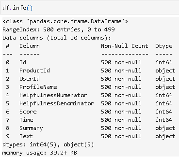

- Checked for missing values

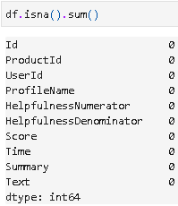

- Visualized food review counts by ratings

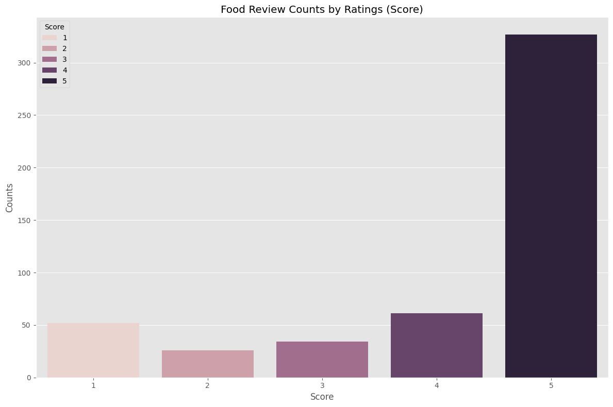

## NLTK Text Preprocessing

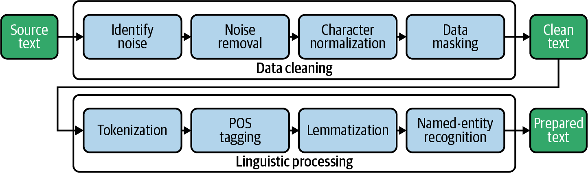

**Image Source:** [Oreilly](https://www.oreilly.com/api/v2/epubs/9781492074076/files/assets/btap_0401.png)

Did the following text preprocessing techniques:

1. Tokenization
2. POS Tagging
3. Stop Word Removal
4. Lemmatization

## VADER Model

- Created a `SentimentIntensityAnalyzer` object for [Polarity Scoring](#polarity-scoring)

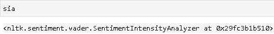

- Tested out polarity scoring method

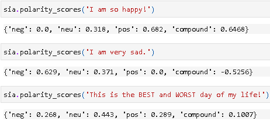

- Applied polarity scoring on the whole dataset and plotted the compound score by star review

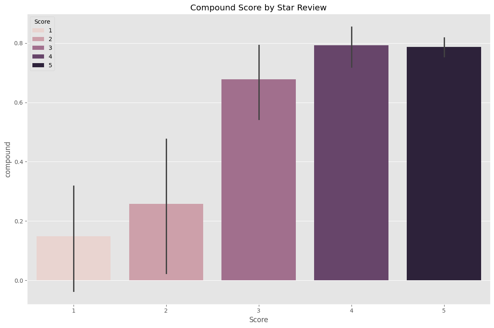

- Plotted the polarity scores by sentiment category

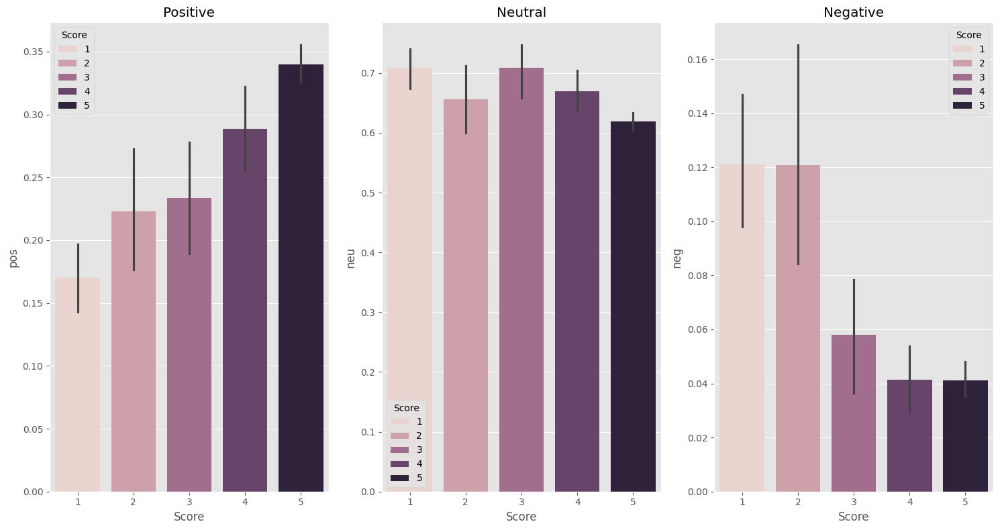

## Roberta Pre-Trained Model

- Imported the `AutoTokenizer`  `AutoModelForSequenceClassification` modules from `transformers`
- Imported `softmax` module from `scipy`
- Did polarity scoring on the whole dataset


## Roberta Model vs. VADER Model

- Plotted the polarity scores of the VADER Model against the Roberta Model

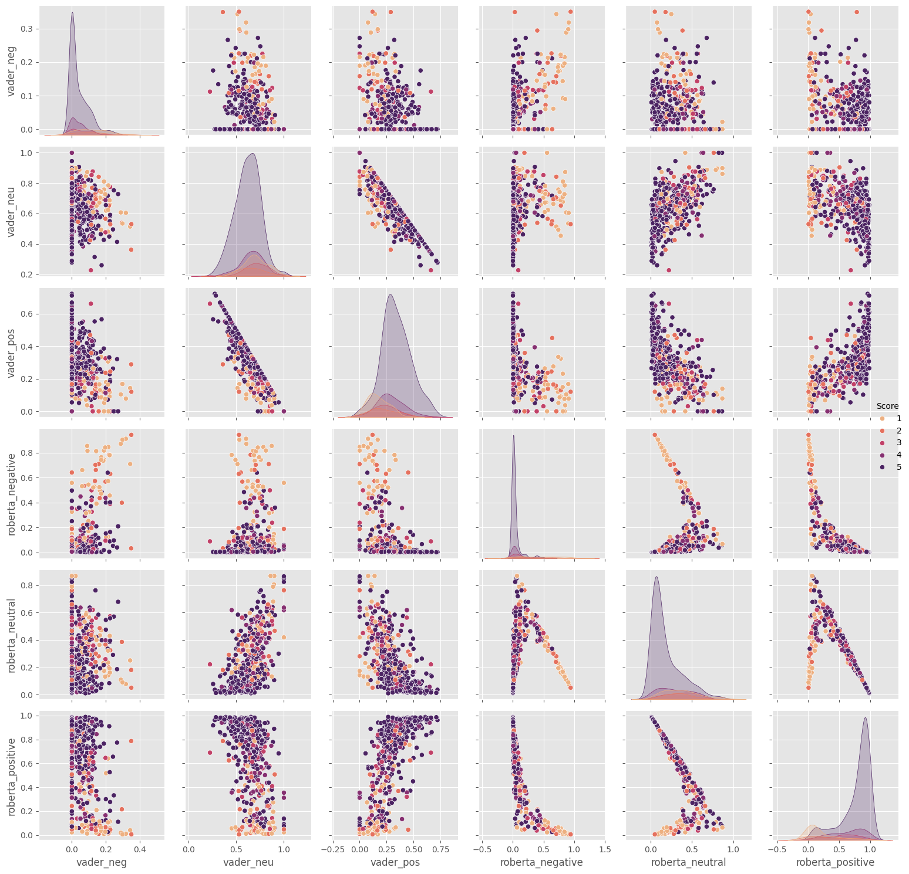

## Hugging Face Transformers Pipeline

- Imported the `pipeline` module from `transformers`
- Created a pipeline object for sentiment analysis

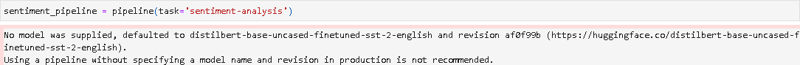

- Tested the pipeline object on sample text for sentiment scoring

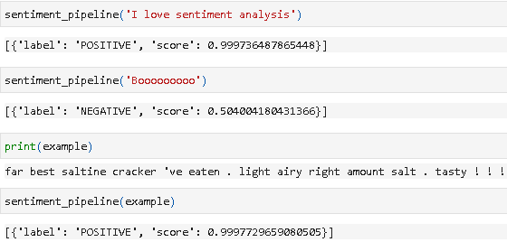

## Conclusion

- Based on the pairplot between the VADER and Roberta model, **there are some correlations between them**
- **The Roberta Model looks to be the more reliable model** as it is more confident in its predictions compared to the VADER model
- While the Roberta model is better, **it's not exempted from having errors** in giving out sentiment scores.
- The **Hugging Face Transformers pipeline** allows you to have **sentiment analysis results with essentially 2 lines of code.**

## References

- Ali, M. (2023, March 23). _NLTK Sentiment Analysis Tutorial for Beginners_. Retrieved December 6, 2023, from https://www.datacamp.com/tutorial/text-analytics-beginners-nltk

- Rob Mulla. (2022). _Python Sentiment Analysis Project with NLTK and 🤗 Transformers. Classify Amazon Reviews!!_ [Video]. YouTube. https://www.youtube.com/watch?v=QpzMWQvxXWk

- Robikscube. (2022). _Sentiment Analysis Python 🤗 [Youtube Tutorial]_. Kaggle. https://www.kaggle.com/code/robikscube/sentiment-analysis-python-youtube-tutorial/notebook

- Stanford Network Analysis Project. (2016). _Amazon Fine Food Reviews_. Kaggle. https://www.kaggle.com/datasets/snap/amazon-fine-food-reviews