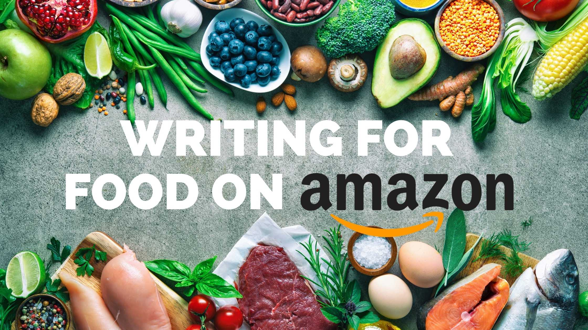

# Sentiment Analysis on Amazon Fine Food Reviews



This is a natural language processing project (NLP) using Python with NLTK, and Hugging Face Roberta Transformers to analyze fine food sentiments on Amazon

This project utilized **3 different approaches for sentiment analysis**:

1. [Valence Aware Dictionary and sEntiment Reasoner (VADER)](#VADER-Model) - Bag of words approach
2. [Roberta Pre-trained model](#Roberta-Pre-trained-Model) from Hugging Face 🤗  
3. [Hugging Face Transformers Pipeline](#Hugging-Face-Transformers-Pipeline)

> [!Note]
> Make sure to open the [NBViewer URL](https://nbviewer.org/github/jpsam07/sentiment-analysis-on-amazon-fine-food-reviews/blob/c5309a2e86b7e084eb5f5eacc4e45aa6d2717922/sentiment_analysis_on_food_reviews.ipynb) for a richer view of the analysis on Jupyter Notebook.

## Table of Contents

- [Data Collection](#data-collection)
- [Environment Setup and Data Loading](#environment-setup-and-data-loading)
- [Data Cleaning](#data-cleaning)
- [Exploratory Data Analysis](#exploratory-data-analysis)
- [Basic NLTK](#basic-nltk)
	- [Tokenization](#tokenization)
	- [Tagging](#tagging)
	- [VADER Model](#vader-model)
	- [Polarity Scoring](#polarity-scoring)
	- [VADER Results](#vader-results)
- [Roberta Pre-trained Model](#roberta-pre-trained-model)
- [Roberta Model vs. VADER Model](#roberta-model-vs-vader-model)
- [Negative Sentiment 5-Star Review](#negative-sentiment-5-star-review)
- [Hugging Face Transformers Pipeline](#hugging-face-transformers-pipeline)
- [References](#references)

## Data Collection

> [!NOTE]
> The procedure as to how the dataset was sampled and collected can be viewed in this [Kaggle Notebook](https://www.kaggle.com/code/joaquinsamson/preparing-data-for-sentiment-analysis)
## Environment Setup and Data Loading

- Loaded in the randomly sampled data from [Kaggle](https://www.kaggle.com/code/joaquinsamson/preparing-data-for-sentiment-analysis) into Jupyter Lab.
- Imported required libraries for analysis:
	- `pandas`: for data management and manipulation
	- `pyarrow`: for loading in parquet files
	- `numpy`: for scientific computing
	- `matplotlib`, `seaborn`: for data visualization and exploration
	- `nltk`: Natural Language Toolkit, a dedicated Python library for natural language processing (contains the VADER Model)

> [!NOTE] 
> Even when you have installed the `nltk` library, you will still need to install additional dependencies for it.

```python
nltk.download('popular') 
nltk.download('vader_lexicon')
```

Once you have run those lines of code, you can proceed to turn them into comments.

## Data Cleaning


## Exploratory Data Analysis (EDA)

## Basic NLTK

## Tokenization

## Tagging

## VADER Model

## Polarity Scoring

## VADER Results

## Roberta Pre-Trained Model

## Roberta Model vs. VADER Model

## Negative Sentiment 5-star Review Examples

## Hugging Face Transformers Pipeline

## References

- Rob Mulla. (2022). _Python Sentiment Analysis Project with NLTK and 🤗 Transformers. Classify Amazon Reviews!!_ [Video]. YouTube. https://www.youtube.com/watch?v=QpzMWQvxXWk

- Robikscube. (2022). _Sentiment Analysis Python 🤗 [Youtube Tutorial]_. Kaggle. https://www.kaggle.com/code/robikscube/sentiment-analysis-python-youtube-tutorial/notebook

- Stanford Network Analysis Project. (2016). _Amazon Fine Food Reviews_. Kaggle. https://www.kaggle.com/datasets/snap/amazon-fine-food-reviews

---

```python
pipeline_results = {}

for index, row in tqdm(df.iterrows(), total=len(df)):
	try:
		text = row['Text']
		my_id = row['Id']
		pipeline_results[my_id] = sentiment_pipeline(text)
	except RuntimeError:
		print(f'Broke at {my_id}')
```

```python
pipeline_results_df = pd.DataFrame(pipeline_results).T
pipeline_results_df = (pipeline_results_df
						  .reset_index()
						  .rename(columns={'index' : 'id'}))
pipeline_results_df = pipeline_results_df.merge(df, how='left')
```